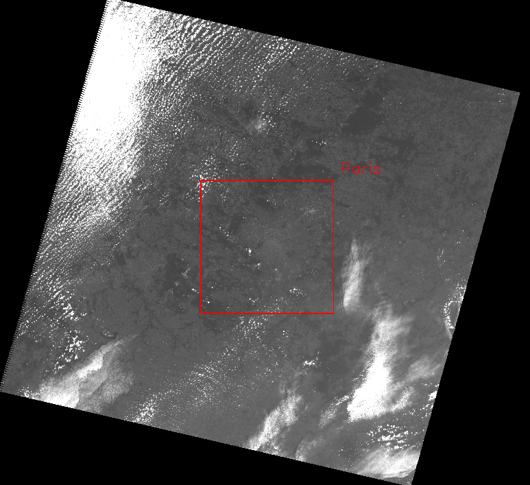
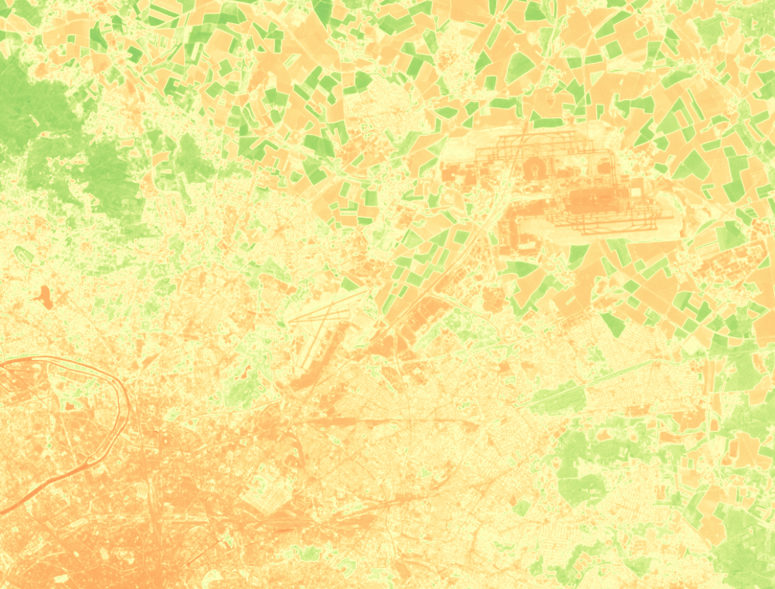

 - Выполнил ст. гр. м30-321бБ Конышев В.
 
## Задание 1

- Требуется вырезать город с заданнными координатами со снимк

### Пример выполнения программы main.py :

  
   
## Задание 2

  - Требуется рассчитать NDVI
  - NDVI: NDVI = (Pnir - Pred)/(Pnir + Pred)
  - Расчёт произодится посредством библиотек numpy и rasterio

  
### Примеры выполнения программы ndvi.py :

  
  
